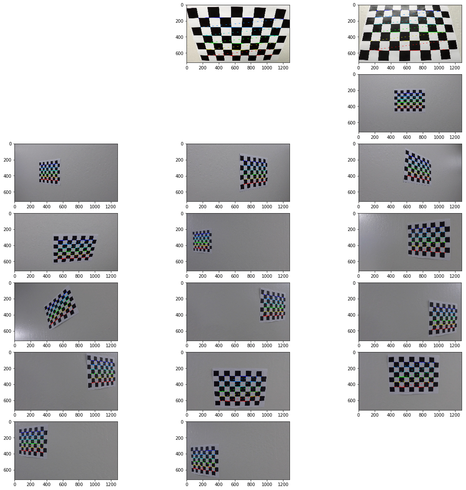
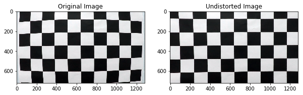
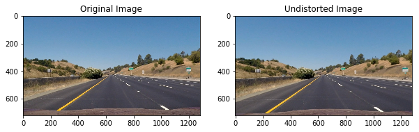
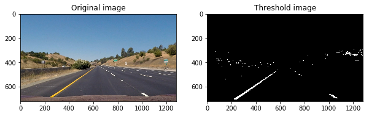
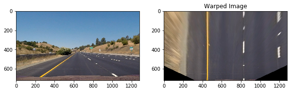
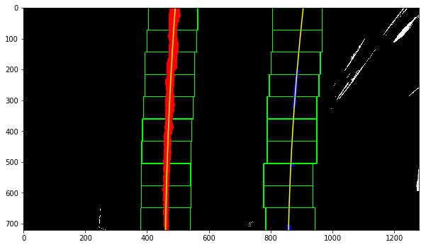
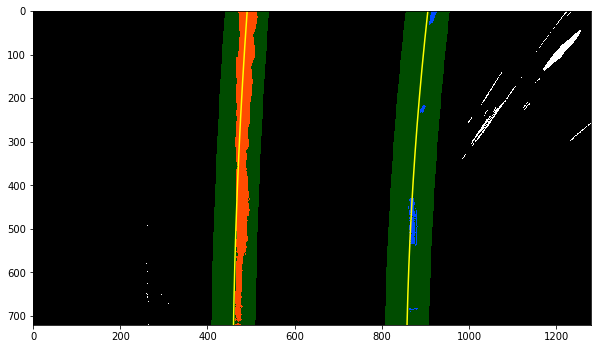
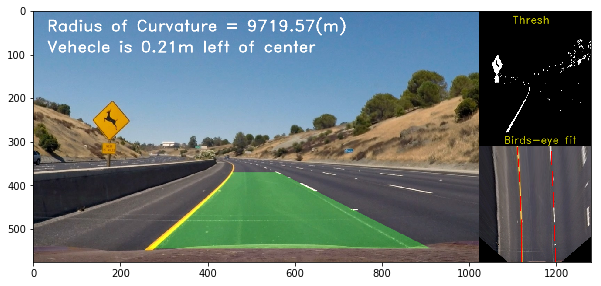

**Advanced Lane Finding Project**

The goals / steps of this project are the following:

* Compute the camera calibration matrix and distortion coefficients given a set of chessboard images.
* Apply a distortion correction to raw images.
* Use color transforms, gradients, etc., to create a thresholded binary image.
* Apply a perspective transform to rectify binary image ("birds-eye view").
* Detect lane pixels and fit to find the lane boundary.
* Determine the curvature of the lane and vehicle position with respect to center.
* Warp the detected lane boundaries back onto the original image.
* Output visual display of the lane boundaries and numerical estimation of lane curvature and vehicle position.

### Here I will consider the rubric points individually and describe how I addressed each point in my implementation.  

---

### Writeup / README

#### 1. Provide a Writeup / README that includes all the rubric points and how you addressed each one.  You can submit your writeup as markdown or pdf. 

[Here](https://github.com/ahmadesh/CarND-Advanced-Lane-Lines/blob/master/writeup_template.md) is my write-up for this project. You're reading it!

### Camera Calibration

#### 1. Briefly state how you computed the camera matrix and distortion coefficients. Provide an example of a distortion corrected calibration image.

The code for this step is contained in the second and third code cell of the IPython notebook located in [Project file](https://github.com/ahmadesh/CarND-Advanced-Lane-Lines/blob/master/Project.ipynb).  

I start by preparing "object points", which will be the (x, y, z) coordinates of the chessboard corners in the world. Here I am assuming the chessboard is fixed on the (x, y) plane at z=0, such that the object points are the same for each calibration image.  Thus, `objp` is just a replicated array of coordinates, and `objpoints` will be appended with a copy of it every time I successfully detect all chessboard corners in a test image.  `imgpoints` will be appended with the (x, y) pixel position of each of the corners in the image plane with each successful chessboard detection in the `cv2.findChessboardCorners()` function. Here are the corners detected on the calibration images:



I then used the output `objpoints` and `imgpoints` to compute the camera calibration and distortion coefficients using the `cv2.calibrateCamera()` function.  I applied this distortion correction to the test image using the `cv2.undistort()` function and obtained this result: 



### Pipeline (single images)

#### 1. Provide an example of a distortion-corrected image.

Using the camera distortion calibration parameters 'mtx' and 'dist', I use the 'cv2.undistort()' function to undistort the images as shown here:



#### 2. Describe how (and identify where in your code) you used color transforms, gradients or other methods to create a thresholded binary image.  Provide an example of a binary image result.

I used a combination of color and x-gradient thresholds to generate a binary image, which I embeded them in the Pipeline function at cell 7. The function takes the image, undistort it and converts it HSL. The threshold are appled to the S and L channels. Also the Sobel in x direction is used to threshold the image. Finally the combination of S & L or x-gradient thresholds are combined to build a binary output image. 

Here's an example of my output for this step. 



#### 3. Describe how (and identify where in your code) you performed a perspective transform and provide an example of a transformed image.

The code for my perspective transform includes a function called `warping()`, which appears in cell 5.  Before defining the `warper()` function the (`src`) and destination (`dst`) points are defined.  I chose the hardcode the source and destination points in the following manner:

```python
source = np.float32([(575,464),
                  (707,464), 
                  (258,682), 
                  (1049,682)])

destination = np.float32([(450,0),
                  (img_size[0]-450,0),
                  (450,img_size[1]),
                  (img_size[0]-450,img_size[1])])
```

This resulted in the following source and destination points:

| Source        | Destination   | 
|:-------------:|:-------------:| 
| 575, 464      | 320, 0        | 
| 707, 464      | 320, 720      |
| 258, 682     | 960, 720      |
| 1049, 682      | 960, 0        |

I verified that my perspective transform was working as expected by drawing the `src` and `dst` points onto a test image and its warped counterpart to verify that the lines appear parallel in the warped image.



#### 4. Describe how (and identify where in your code) you identified lane-line pixels and fit their positions with a polynomial?

Then I fit my lane lines with a 2nd order polynomial. This devides into two cases. The first case is when there is not approximation for the lane lines that is in the function 'slidingWindow()' in the cell 10. This function, takes a binary image, and does the following steps:

- Caluclates the histogram of the bottom half of the image and detects two peaks associating with the approximate lines at the bottom of the image. 

- Then a sliding window starts from the detected locations and finds the indices of the hot pixels and slides to the top of the image. 

- Finally, a second order pollynomial is fit to the points found for the lines. 

Here is the visualization of the sliding window method to find and fit to lines:



In case there is a fir for the previous frame. The other function that is 'laneWithwindow()' is used to find and fit to the lines and can be found in cell 12. In this function the windows to search for the lines is approximated to be around the previous line. Therefore, the hot points in the windows are found and a second order polynomials is fit to them. Here is a result of this function:



#### 5. Describe how (and identify where in your code) you calculated the radius of curvature of the lane and the position of the vehicle with respect to center.

I did this in lines # through # in my code in `my_other_file.py`

#### 6. Provide an example image of your result plotted back down onto the road such that the lane area is identified clearly.

I implemented this step in cell 14 and in the function `curvature()`. The fit found for lines are the inputs and in the case of second order polynomials the curvature can be found as:

Also the offset of the veheicle from the center of the lines is calculated in this function. 

Here is an example of my result on a test image with the calculated radius of curvature and the offset from center:


---

### Pipeline (video)

#### 1. Provide a link to your final video output.  Your pipeline should perform reasonably well on the entire project video (wobbly lines are ok but no catastrophic failures that would cause the car to drive off the road!).

The pipeline function for processing the video images is the 'imageProcess()' function. This function passes the image to binary thresholds and warpes the image to get the birds eye view. Then if there is a fit for the left and right lines, passes the image to the 'laneWithwindow()' function and otherwise the 'slidingWindow()' function that return the fittings to the left and right lines found. Then it checks to see if the difference between the x intercepts of the lines (bottom points) is within a range that is the width of the lane. 

Next, the dected fittings are passed to the 'update()' function of the line classes (defined in cell 19) to keep track of the calculated fittings. This function checks the difference between the current and previous fitting and rejects the fittings with too much variation. If the fitting passes the checks, it is added to the list of the passed 4 fittings and their average is stored as the best fit detected.

Finally, the the area between the detected lines is filled and unwarped on the original image using the 'addDrawing()' function. Also the curvature and offset are put as text on top of the image which produces the final image. I also added the binary image and the eye-birds view with the fitting lines to the side of the image. An example of the processed image is shown here:



The processed video on the project video can be found here:

[

### Discussion

#### 1. Briefly discuss any problems / issues you faced in your implementation of this project.  Where will your pipeline likely fail?  What could you do to make it more robust?

Here I'll talk about the approach I took, what techniques I used, what worked and why, where the pipeline might fail and how I might improve it if I were going to pursue this project further.
